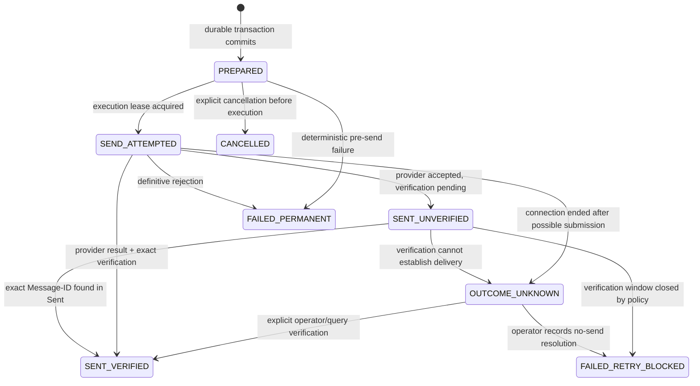

# Functional Spec — Hermes Mail Gateway

## Purpose and contract

Hermes Mail Gateway is a local, fail-safe MCP service for querying and sending mail through trusted Gmail, Zoho, and generic IMAP/SMTP accounts. The v1 contract is intentionally small: four MCP tools, one `accountId` routing field, durable send state, and no automatic retry after an ambiguous provider outcome.

The gateway is an authority for local intent and observed delivery state. It is not an authority that can guarantee a provider accepted a message when the network result is unknown.

## Functional requirements

### FR-1 — Account discovery and health (`mail_accounts`)

- Inputs: no account secrets; optional `includeHealth` boolean, default `true`.
- Preconditions: caller is the authorized Hermes `main` profile; the service is running.
- Processing: load the configured account registry; never expose credential material; when health is requested, perform bounded, non-mutating capability checks against the account's configured IMAP/SMTP endpoints.
- Outputs: stable `accountId`, display name, provider kind, enabled status, capabilities, Sent policy, and redacted health state. The output must not contain usernames unless explicitly configured as safe display metadata, passwords, tokens, connection strings, or server diagnostics.
- Success: return all configured accounts in deterministic order, including accounts currently unavailable.
- Empty: return an empty list with a success result if no accounts are configured.
- Errors: reject unauthorized callers, malformed input, unavailable configuration, and dependency/runtime failures without exposing internal details.
- Postcondition: no mailbox or outbox state is changed.

### FR-2 — Bounded mail query (`mail_query`)

- Inputs: `accountId`, operation (`list`, `search`, `read`, `thread`, `attachments`, or `verifySent`), optional folder, query/filter, opaque message reference, pagination cursor, and bounded limit.
- Preconditions: account exists and is enabled; the caller is authorized for that account; `read`, `thread`, `attachments`, and `verifySent` have a valid opaque message reference or verification selector.
- Processing: validate the complete input schema and reject unknown fields; resolve `accountId` only through the local registry; use parameterized/search-library operations; enforce a server-side result and body-size limit; redact or omit unsupported fields.
- Outputs: normalized message summaries or requested bounded content, with opaque references, stable message metadata, and provider-independent dates where available. Attachment-only queries return bounded filename/content type/size metadata; thread queries return bounded normalized summaries matched by server-side Message-ID, In-Reply-To, and References criteria. Raw provider response objects and attachment bytes are never returned.
- Success: return matching results and a continuation cursor when more results exist.
- Empty: return an empty result set, not an error, for a valid query with no matches.
- Errors: invalid account, invalid folder/query/reference, authorization failure, provider unavailability, malformed provider data, size limit, and verification-not-found are distinct error codes.
- Postcondition: query operations do not mutate mail or the outbox. `verifySent` records an observation in the audit log but does not alter send state by itself.

### FR-3 — Durable message preparation (`mail_prepare`)

- Inputs: `accountId`, sender policy, recipients, subject, plain-text and/or HTML body, optional reply/forward reference, attachment descriptors, and a client-supplied idempotency key.
- Preconditions: account exists and is enabled; at least one valid To recipient exists; sender is permitted by account configuration; message size, combined recipient count, header lengths, and attachment limits are within policy; attachment paths are inside configured allow-listed roots.
- Processing: normalize and validate To/CC/BCC addresses and caller-supplied reply/forward metadata; derive attachment roots from the account projection; hash and size-check every attachment; assign a Message-ID; build complete MIME before persistence; insert the intent, raw MIME BLOB, routing metadata, and idempotency record in one SQLite transaction. Forwarding metadata records a caller-supplied source reference and optional original headers; it does not fetch a source message.
- Outputs: `messageId` (gateway identifier), assigned `messageIdHeader`, `accountId`, immutable content summary, attachment hashes/sizes, current state `PREPARED`, and a redacted audit event. No network send occurs.
- Idempotency: repeating the same idempotency key for the same account and equivalent request returns the original preparation; reusing it for a different request is rejected as a conflict.
- Errors: validation, unsupported content, attachment policy, duplicate-key conflict, account disabled, persistence failure, and internal serialization failure. No preparation is returned as sendable if its transaction did not commit.
- Postcondition: a durable outbox row exists before any later execution can send the message.

### FR-4 — Idempotent message execution (`mail_execute`)

- Inputs: `accountId`, gateway `messageId`, and an explicit execution request. The request may include `verifyOnly`; it may not replace the persisted message content or recipients.
- Preconditions: the prepared message exists, belongs to `accountId`, and is in an executable state. `PREPARED` is executable; `SENT_VERIFIED` and `CANCELLED` are terminal; `SEND_ATTEMPTED`, `OUTCOME_UNKNOWN`, `SENT_UNVERIFIED`, and `FAILED_RETRY_BLOCKED` require recovery/verification semantics and never blind resend.
- Processing: atomically claim the message for a single execution owner; submit the exact persisted MIME message through the configured SMTP adapter; classify the result; for an acknowledged submission, verify the exact preassigned Message-ID in the provider-managed or explicitly configured Sent location; persist the observed state and audit event. If provider behavior is ambiguous, stop and preserve the state.
- Outputs: state, gateway `messageId`, Message-ID header, provider submission evidence at a redacted level, verification result, and next permitted action. Never return credentials, raw SMTP transcripts, or arbitrary provider payloads.
- Success: only `SENT_VERIFIED` is a confirmed send.
- Empty/duplicate execution: an already `SENT_VERIFIED` message returns its terminal result without sending again; an already claimed execution returns a conflict or in-progress result.
- Errors: not found, account mismatch, invalid state transition, SMTP rejection, connection failure before submission, connection failure after possible submission, Sent verification failure, persistence failure, and authorization failure. No unknown result triggers an automatic retry.
- Postcondition: every attempt has a durable state and audit record, including failures. The exact persisted MIME and Message-ID are retained until retention policy permits cleanup.

### FR-5 — Safe organization and non-destructive mailbox actions

Organization operations are limited to the query tool's explicitly defined, allow-listed non-destructive actions if included in the implementation slice: mark read/unread, archive, and move between configured folders. Permanent deletion, trash-emptying, bulk mutation, and arbitrary IMAP commands are out of scope for v1. Each mutation requires account authorization, schema validation, bounded targets, an audit event, and a provider-confirmed result.

### FR-6 — Auditability and redaction

- Every tool invocation records timestamp, authorized caller, tool, account identifier, request correlation identifier, outcome code, and latency.
- Prepare/execute records include message gateway ID, Message-ID header, recipient domains/count, attachment hashes/sizes, and state transitions—not body content, credentials, tokens, or full provider transcripts by default.
- Logs and SQLite files use restrictive service-user permissions. Sensitive diagnostics are available only through local operator procedures, never MCP output.

## Data model

The SQLite database is the source of truth for gateway intent, idempotency, state transitions, and audit metadata. Provider mailboxes remain the source of truth for observed mailbox contents.

### `accounts` (configuration projection)

| Field | Rules |
|---|---|
| `account_id` | Stable opaque identifier; primary key; referenced by every tool. |
| `display_name` | Operator-controlled non-secret label. |
| `provider_kind` | `gmail`, `zoho`, or `generic_imap_smtp`. |
| `imap_endpoint` / `smtp_endpoint` | Configuration references; never tool-visible as raw secret-bearing values. |
| `credential_ref` | IMAP keychain/Secret Service reference, never credential value. |
| `smtp_credential_ref` | Optional SMTP keychain/Secret Service reference; NULL means fall back to `credential_ref`. Never a credential value. |
| `sent_policy` | `provider_managed` for Gmail/Zoho; explicit `provider_managed` or `gateway_append` for generic accounts after verification. |
| `enabled` | Operator-controlled activation flag. |
| `allowed_sender` | Exact configured sender identity or domain policy. |
| `mailbox_policy` | Allow-listed folders, query limits, attachment roots, and size limits. |

Account configuration is local operator state and is not accepted from MCP tool arguments.

### `outbox_messages`

| Field | Rules |
|---|---|
| `message_id` | Gateway-generated opaque primary key. |
| `account_id` | Foreign key to the account used for preparation. |
| `idempotency_key` | Unique per account; immutable request identity. |
| `message_id_header` | Preassigned globally unique Message-ID; immutable and emitted in the MIME message. |
| `from_address` / recipient set | Normalized addresses; recipient values are stored only as required for delivery/audit. |
| `subject` / body representation | Immutable persisted MIME inputs; retention-controlled and access-restricted. |
| `reply_headers` | Validated `In-Reply-To` and `References`, if applicable. |
| `attachment_manifest` | Allow-listed path metadata, content hash, size, and MIME type; source paths are read only during preparation. |
| `raw_mime` | Complete immutable MIME bytes stored as a SQLite BLOB in the same transaction as the outbox and idempotency rows; never returned by MCP. |
| `state` | Enumerated state machine below. |
| `attempt_owner` / lease | Short-lived execution ownership to prevent concurrent sends. |
| `created_at` / `updated_at` | UTC timestamps. |
| `provider_evidence` | Redacted, bounded evidence and verification metadata. |

### `idempotency_keys`

Unique `(account_id, idempotency_key)` mapping to the original gateway message and a canonical request digest. A digest mismatch is a hard conflict.

### `audit_events`

Append-only event records with event ID, correlation ID, caller identity, tool, account, gateway message ID where relevant, old/new state, outcome code, safe metadata, and timestamp. No secret-bearing payloads.

### Outbox state transitions

There is no transition from `OUTCOME_UNKNOWN` to a blind resend. A future explicit operator action may create a new preparation with a new idempotency key only after the original outcome is understood or deliberately accepted as unresolved.

## Integrations

### MCP transport and authorization

- Transport: loopback HTTP MCP endpoint, reachable only by the Hermes `main` profile through local configuration.
- Every request is authenticated and authorized before tool dispatch. The authorization design must validate a local bearer/token mechanism and bind it to the permitted `main` client; no network-wide exposure is allowed.
- Tool schemas reject unknown fields and hostile paths/identifiers. Results are bounded and normalized.
- HTTPS/TLS is required if the endpoint ever leaves loopback; v1 does not authorize remote exposure.

### IMAP

- Purpose: bounded mailbox listing/search/read, thread/header retrieval, attachment metadata, Sent verification, and approved organization actions.
- Auth: account credential reference resolved by the host keychain/Secret Service; credentials never enter MCP arguments or logs.
- Operations: only library-supported parameterized mailbox operations; no arbitrary command passthrough.
- Failure handling: account health becomes unavailable; queries fail with a stable provider-unavailable error; no send fallback is attempted.
- Limits: connection timeout, command timeout, result count, body/attachment size, concurrent operation count, and provider-specific folder allow-list.

### SMTP

- Purpose: submission of the exact persisted MIME message.
- Auth: account credential reference resolved locally; sender identity must match account policy.
- Operations: connect, authenticate, submit once per execution claim, classify response. No blind retry.
- Failure handling: definitive rejection is permanent for the preparation; pre-submission connection failure may remain executable only when the gateway can prove no submission occurred; all other connection loss is `OUTCOME_UNKNOWN`.
- Limits: message size, recipient count, command/connection timeouts, and per-account execution rate.

### MIME and attachment handling

- Use a mature MIME library. The gateway validates content type, header encoding, line lengths, attachment roots, file existence, size, and SHA-256 hash while building MIME before preparation persistence.
- Attachment paths are resolved only under configured allow-listed roots. Symlink escapes, special files, path traversal, and changed hashes are rejected.
- The exact MIME representation is persisted as raw bytes before SMTP submission. Execution never regenerates MIME or rereads attachment paths.

### SQLite

- One service-owned database is the durability authority.
- Outbox preparation, idempotency mapping, state transition, lease handling, and audit append are transactional.
- WAL mode, foreign keys, busy timeout, restrictive file permissions, and explicit migration versions are required. A database failure blocks sends rather than allowing an in-memory fallback.

### Provider Sent policy

- Gmail and Zoho use provider-managed Sent by default; the gateway does not append a second copy.
- Generic accounts require an explicit account policy. `gateway_append` is permitted only after a provider-specific verification proves the provider does not already create the Sent copy.
- Verification searches the configured Sent location for the exact preassigned Message-ID and applies bounded matching rules; subject/time/recipient coincidence alone is insufficient.

## Permissions matrix

| Actor | `mail_accounts` | `mail_query` | `mail_prepare` | `mail_execute` | Configuration/credentials |
|---|---|---|---|---|---|
| Hermes `main` | Read account metadata/health | Read permitted mail and perform allow-listed organization actions | Create durable intents for permitted accounts | Execute or verify its own prepared intents | No access |
| Other Hermes profiles | Denied | Denied | Denied | Denied | No access |
| Local operator/service owner | Via separate local administration, not MCP | Can inspect redacted operational state | Can cancel/recover according to documented procedure | Can perform explicit verification/recovery | May configure through host procedures |
| Provider | N/A | Serves authenticated mailbox operations | N/A | Receives SMTP submission and exposes Sent observation | Stores provider-side credentials/identity |

No MCP tool is an administrative configuration channel. Account setup, credential rotation, database migration, and log access are operator-only host procedures.

## Error taxonomy

Errors are stable, machine-readable, safe to expose, and accompanied by a correlation ID. Internal causes are logged only in redacted form.

| Code | Class | Meaning | Client action |
|---|---|---|---|
| `AUTH_REQUIRED` / `AUTH_FORBIDDEN` | Authorization | Missing/invalid caller authorization or non-main profile | Correct local authorization; do not retry blindly. |
| `INVALID_INPUT` | Validation | Schema, unknown field, address, header, or limit violation | Fix request. |
| `ACCOUNT_NOT_FOUND` / `ACCOUNT_DISABLED` | Routing | Account is not configured or active | Select a configured account or ask operator. |
| `REFERENCE_INVALID` / `MESSAGE_NOT_FOUND` | Mail reference | Opaque reference cannot be resolved | Query again and use a current reference. |
| `ATTACHMENT_FORBIDDEN` / `ATTACHMENT_CHANGED` | File policy | Path outside roots, unsafe file, or changed hash | Fix attachment and prepare again. |
| `IDEMPOTENCY_CONFLICT` | Idempotency | Key reused with different request | Use the original result or a new key after review. |
| `STATE_CONFLICT` / `EXECUTION_IN_PROGRESS` | Concurrency | Requested transition is not currently permitted | Inspect state; do not parallel-execute. |
| `PROVIDER_UNAVAILABLE` | Integration | IMAP/SMTP endpoint unavailable or timed out | Query health; do not resend an ambiguous send. |
| `PROVIDER_REJECTED` | Integration | Definitive SMTP/provider rejection | Correct cause and prepare a new message if appropriate. |
| `OUTCOME_UNKNOWN` | Reliability | Submission may have occurred but cannot be established | Verify exact Message-ID; never automatic retry. |
| `SENT_UNVERIFIED` | Reliability | Submission evidence exists but exact Sent verification failed | Verify explicitly or resolve as blocked. |
| `DATABASE_UNAVAILABLE` / `MIGRATION_REQUIRED` | Durability | Durable authority unavailable or incompatible | Stop operations; operator repairs runtime. |
| `INTERNAL_SAFE_FAILURE` | Internal | Unexpected failure, details withheld | Use correlation ID for operator diagnosis. |

## Flows index

- [Installation and activation](flows/install-activation.md)
- [Account discovery and bounded query](flows/account-query.md)
- [Prepare a message](flows/prepare-message.md)
- [Execute and verify a send](flows/execute-send.md)
- [Recover an ambiguous outcome](flows/ambiguous-outcome.md)
- [Attachment validation](flows/attachment-validation.md)

## Technical plan

See [`docs/03-technical-plan.md`](03-technical-plan.md) for stack, architecture, code map, conventions, deployment, and testing structure.

## Design split

### Needs design

None. This is a headless local service and MCP server with no human-facing UI.

### No design needed

MCP tools, SQLite state, IMAP/SMTP adapters, MIME handling, logging, systemd deployment, operator procedures, and test fixtures.

### External manual setup

- Install the pinned Node.js runtime and service package on Debian 13.
- Create the service user, loopback-only transport configuration, systemd user unit, and restrictive directories.
- Configure the three operator-controlled accounts and their credential references in the host keychain/Secret Service; no credential values belong in the repository.
- Configure the self-test recipient outside the repository.
- Verify provider-specific Sent policy, especially generic-account behavior, before enabling execution.

### External assets

None.

## Acceptance criteria

### Accounts and authorization

- Only the authorized Hermes `main` profile can invoke the four tools.
- Account output contains no credentials or secret-bearing configuration.
- Unknown tool fields, invalid identifiers, unbounded limits, and disallowed paths are rejected.

### Query

- Valid list/search/read/thread/attachment/verification requests return normalized, bounded results.
- Valid no-match queries return an empty result.
- Provider failure returns a stable safe error and never exposes stack traces or raw transcripts.
- Every query is audited without logging full message bodies by default.

### Preparation

- A valid preparation commits its outbox row, idempotency mapping, assigned Message-ID, and audit event transactionally before any network send.
- Repeating the same request/key returns the original preparation; a digest mismatch is rejected.
- Invalid addresses, headers, attachments, paths, sizes, and account sender policy prevent persistence.

### Execution and verification

- The persisted MIME message and preassigned Message-ID are used exactly once per execution claim.
- A send is reported confirmed only after exact Message-ID Sent verification.
- Gmail and Zoho do not receive a gateway-appended duplicate Sent copy.
- Definitive rejection is recorded; connection loss after possible submission becomes `OUTCOME_UNKNOWN`.
- No automatic retry exists for `OUTCOME_UNKNOWN`, `SENT_UNVERIFIED`, or equivalent ambiguous states.

### Durability and operations

- SQLite failure prevents send execution rather than falling back to memory.
- Restart recovery preserves outbox states, idempotency, leases, and audit records.
- Logs and database files are owned and permissioned for the service user and contain no credentials/tokens.
- The service runs only through the pinned systemd user deployment and loopback MCP transport.

### Test safety

- Unit and integration fixtures use synthetic mail data.
- Real-provider tests, if explicitly run later, can target only the operator-controlled self-test address configured outside the repository.
- No test targets customer or third-party addresses, and this specification does not claim any real-provider tests have run.

## Explicit non-goals for v1

- Gmail API or Zoho Mail API/OAuth adapters.
- Remote or multi-user MCP access; only Hermes `main` is authorized.
- Automatic retry after any unknown delivery outcome.
- Permanent deletion, trash emptying, arbitrary IMAP commands, or bulk destructive mailbox operations.
- Provider webhooks, push notifications, or inbox synchronization jobs.
- Full-text indexing, semantic search, or attachment content extraction.
- Calendar, contacts, tasks, labels beyond the allow-listed organization slice, or email sending from unprepared content.
- Importing Himalaya configuration or existing outbox data.
- Provider-independent guarantees about delivery, spam placement, or recipient receipt.
- UI, web dashboard, multi-language runtime output, or customer-facing administration.

## Open questions for the user

None required to preserve the agreed v1 contract. Implementation must still resolve operational values before development: exact dependency versions, concrete local authorization token provisioning, provider endpoint details, account-specific folder names, retention periods, and configured size/rate limits. These are deployment/configuration decisions, not permission to change the four-tool or reliability contract.
