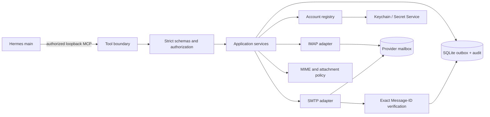

# Technical Plan — Hermes Mail Gateway

## Stack (exact versions)

- Runtime: Node.js 24.20.0 minimum for the first deployment target, TypeScript 7.0.2 in strict mode, and npm lockfile with exact dependency resolution.
- Protocol: `@modelcontextprotocol/sdk` 1.30.0 for the four semantic tools over stdio.
- Mail: `imapflow` 2.0.0, `nodemailer` 10.0.1, and `mailparser` 3.9.23; no protocol implementation from scratch.
- Validation: `zod` 4.5.4 with strict object validation and unknown-field rejection.
- Persistence: `better-sqlite3` 13.0.3 with WAL, prepared statements, and explicit migrations.
- Secrets: host keychain/Secret Service references; credentials are never stored in SQLite or MCP configuration.
- Host: Debian 13, one pinned systemd user service, one service-owned SQLite authority.
- License: MIT. Every dependency license must be checked for MIT compatibility before adoption.

Why this stack: it keeps the protocol surface mature and small while placing reliability-critical state transitions in a local transactional authority. Node.js/TypeScript gives the MCP boundary and adapter contracts one typed runtime without adding a web UI or remote control plane.

## Support matrix & budgets

| Area | v1 support/budget |
|---|---|
| Host | Debian 13, service user, systemd user supervision. |
| Runtime | Node.js 22 LTS minimum; exact patch pinned before scaffold. |
| Accounts | Gmail, Zoho, and generic IMAP/SMTP. |
| Transport | Local stdio MCP only; network transport is deferred until authenticated transport exists. |
| Result limits | Configured server-side maximums for query rows, read bytes, attachment bytes, and recipients. Query/read limits are implemented in this slice; concurrency, timeouts, rates, and backoff are the next P0 slice. |
| Reliability budget | One execution claim per prepared message; zero blind retries; every attempt durably classified. |
| Availability posture | Fail closed when SQLite, keychain, migrations, or authorization are unavailable. |

## Architecture

Components:

1. **MCP transport and authorization** — trusts the selected local stdio boundary, dispatches only the four tools, bounds request/response sizes, and emits invocation audit metadata.
2. **Tool schemas** — strict input/output contracts, identifier/path allow-lists, and safe error mapping. Tools never access adapters directly.
3. **Application services** — account listing, query orchestration, preparation, execution, verification, and permitted organization actions.
4. **Outbox/state machine** — transactional persistence, idempotency mapping, execution lease, transition validation, restart recovery, and audit append.
5. **Account registry** — local non-secret configuration and provider policy; credentials are references only.
6. **IMAP adapter** — normalized bounded reads, Sent lookup, and explicitly allowed organization operations.
7. **SMTP adapter** — one submission of persisted MIME per execution claim with outcome classification.
8. **MIME/attachment policy** — deterministic composition, header validation, allow-listed file roots, hash/size checks, and exact Message-ID handling.
9. **Operational layer** — systemd user supervision, migrations, health diagnostics, restrictive filesystem permissions, and redacted logs.

Data flow rules:

- `mail_prepare` must build complete MIME and commit its raw bytes in SQLite before network activity is permitted.
- `mail_execute` reads the immutable raw MIME BLOB before claiming; callers cannot modify content and execution never rereads attachment paths or regenerates MIME.
- Provider interaction results are classified before state transition and audit append.
- Sent verification is an explicit observation using the exact preassigned Message-ID.
- Any ambiguous post-submission condition stops execution and requires explicit verification/recovery.

### Persistence and migrations

SQLite schema ownership lives in a dedicated migration module. Migrations are numbered, forward-only, transactional where SQLite permits, and idempotence-tested. Startup refuses service activation when migrations are missing, incompatible, or cannot obtain the database lock. There is no fallback database and no in-memory send queue.

Required tables and invariants are defined in [`docs/02-functional-spec.md`](02-functional-spec.md): `accounts`, `outbox_messages`, `idempotency_keys`, and `audit_events`. Foreign keys and unique constraints enforce account routing and idempotency at the database boundary.

## Code map

The source tree implements this map; runtime composition is provided by `src/runtime.ts` and the executable process by `src/main.ts`.

| Path | Purpose |
|---|---|
| `src/index.ts` | Public library exports. |
| `src/main.ts` | Process entrypoint, fail-closed startup, stdio transport, and database lifetime. |
| `src/config/` | Strict configuration model; `src/runtime.ts` performs explicit file loading and composition. |
| `src/auth/` | Reserved for future authenticated network transport; local stdio is the v1 boundary. |
| `src/mcp/` | Tool registration, schemas, safe result/error mapping, and request bounds. |
| `src/application/` | Use cases for accounts, query, prepare, execute, verify, and organization. |
| `src/domain/` | Account, message, idempotency, audit, and outbox state types/invariants. |
| `src/outbox/` | SQLite repositories, migrations, leases, transitions, and transaction coordination. |
| `src/mail/imap/` | IMAP adapter and normalized mailbox operations. |
| `src/mail/smtp/` | SMTP adapter and submission outcome classification. |
| `src/mail/mime/` | MIME composition, parsing, Message-ID, header, and attachment policy. |
| `src/security/` | Secret references, path allow-listing, redaction, rate limits, and safe diagnostics. |
| `src/observability/` | Structured redacted logs, audit events, correlation IDs, and metrics. |
| `src/operations/` | Startup health, migration checks, shutdown, and operator diagnostics. |
| `migrations/` | Versioned SQLite schema migrations. |
| `test/unit/` | Pure state, validation, MIME, redaction, and error tests. |
| `test/integration/` | SQLite, adapter fakes, transport authorization, and restart/recovery tests. |
| `test/real-provider/` | Opt-in self-only tests; credentials/configuration outside the repository; never customer targets. |
| `deploy/systemd/` | Pinned user-service template and operator installation instructions. |
| `docs/` | Stable specifications, flows, test points, architecture, and operator documentation. |

## Conventions

- Prefix/namespace: TypeScript modules use domain-oriented names under `src/`; public MCP tool names are exactly `mail_accounts`, `mail_query`, `mail_prepare`, and `mail_execute`.
- Naming: `camelCase` variables/functions, `PascalCase` classes/types, `SCREAMING_SNAKE_CASE` enum members where serialized, kebab-case flow/docs filenames, and opaque IDs at external boundaries.
- Error handling: typed result/error objects at the MCP boundary; exceptions may be used internally but must be mapped to stable safe error codes. Never return stack traces or provider transcripts.
- Transactions: repositories expose explicit transaction scopes; state transitions are validated in domain code and enforced by database constraints.
- Logging: structured logs with correlation IDs and levels (`debug`, `info`, `warn`, `error`); never log credentials, tokens, Authorization headers, full arguments, message bodies, or full MIME. Audit events are separate from diagnostic logs.
- Time: store UTC timestamps; use monotonic durations for latency; provider dates are normalized with source metadata.
- IDs: gateway IDs and opaque message references are generated locally; Message-ID is assigned before persistence and never regenerated for an existing outbox row.
- Configuration: runtime configuration is loaded from operator-managed files/environment/keychain references; `credentialRef` selects IMAP and optional `smtpCredentialRef` selects SMTP, falling back to `credentialRef`; MCP input cannot define endpoints, roots, credentials, or policy limits.

## Security boundaries

1. **Caller boundary:** the selected local stdio process is the v1 trust boundary; authenticated network transport is deferred and must be designed before any remote exposure.
2. **Tool boundary:** strict schemas, no unknown fields, bounded results, safe error mapping, and rate/concurrency limits.
3. **Account boundary:** `accountId` maps only to operator-configured account records. A caller cannot supply an endpoint or credential reference.
4. **Filesystem boundary:** attachment paths are canonicalized and confined to configured roots; hashes are checked at prepare and execute.
5. **Secret boundary:** keychain/Secret Service is the only credential source. Secrets never enter tool output, SQLite, logs, fixtures, or repository files.
6. **Mailbox boundary:** only bounded, parameterized operations are exposed; folder paths are discovered from the authenticated provider or taken from account defaults, while permanent deletion and arbitrary commands are excluded.
7. **Send boundary:** no SMTP submission before durable preparation; exact immutable MIME and Message-ID are used; ambiguous outcomes halt.
8. **Observability boundary:** logs and audit data are redacted and permission-restricted; diagnostic detail is operator-only.

## Operational deployment

- Install a pinned package/build under a dedicated service account on Debian 13.
- Create service-owned directories for database, runtime configuration references, logs, and temporary MIME/attachment work; set restrictive permissions and do not place credentials in them.
- Run one systemd user service with restart supervision for process crashes, but do not configure a mail-send retry loop. Process restart must recover durable state, not resubmit unknown messages.
- Launch the MCP server through the selected Hermes profile. Do not expose a public port or reverse proxy in v1.
- At startup, validate runtime version, migrations, database integrity, secret-store availability, configuration schema, and account policy. Fail closed with a safe diagnostic when any prerequisite is invalid.
- Rotate credentials through the host keychain/Secret Service and operator procedure. The gateway must not print or persist the replacement value.
- Back up SQLite according to an operator-defined local policy while preserving restrictive permissions. Restore procedures must account for possible provider-side sends and must never blindly replay outbox rows.
- Observe service health, database errors, provider availability, state counts, unknown outcomes, verification failures, and authorization failures. Metrics/logs must not include message bodies or secrets.

## Testing

Framework and commands are fixed at scaffold time after dependency versions are pinned. The planned commands are:

- `npm run lint` — strict static checks.
- `npm run typecheck` — TypeScript no-emit type checking.
- `npm test` — unit and safe integration suite.
- `npm run test:integration` — SQLite, transport, adapter-fake, restart, and state-machine tests.
- `npm run test:real-provider` — explicit opt-in self-only provider tests using configuration outside the repository; never run against customer/third-party addresses.
- `npm run build` — production compilation/package validation.

Test points:

- Schema rejection, authorization, account routing, bounded outputs, path allow-listing, and redaction for every tool.
- Transaction atomicity and idempotency conflict behavior.
- All allowed and forbidden outbox transitions, concurrent execution claims, restart recovery, and migration failures.
- MIME determinism, preassigned Message-ID, reply headers, attachment hashes, size limits, and provider Sent policy.
- SMTP outcome classification for definitive reject, pre-submit failure, post-submit ambiguity, and acknowledged submission.
- Exact Message-ID verification, provider-managed Sent copies, blocked ambiguous recovery, and a separate durable provider Drafts APPEND path with `\\Draft` verification; the gateway never appends to Sent.
- Credential absence, database lock/corruption, provider timeout, malformed mailbox data, and safe error mapping.
- Self-only real-provider tests, if configured, limited to the operator-controlled recipient outside the repository.

Verification playground: a disposable local SQLite database, fake IMAP/SMTP adapters, synthetic message fixtures, and a loopback MCP client. A real-provider run is a separately configured operator action and is not required for this documentation pass.

Regression rule: every bug fix adds a test that pins the failure and, when it reflects a process mistake, an entry in `docs/lessons-learned.md`.

## Tooling commands

The exact commands above are the planned interface and must be verified end-to-end during the Phase 5 scaffold. No command is claimed to have run in this specification-only phase.

## Version touchpoints

- `package.json` version and lockfile.
- Build/package metadata, if emitted by the chosen packaging tool.
- Deployment artifact name or service metadata, if it includes a version.
- Documentation release/version references introduced in Phase 7.

Phase 7 must update all version touchpoints together. This repository currently has no implemented runtime version to synchronize.

## License & dependency compatibility

The project is MIT-licensed. Before adding a dependency, record its exact version and verify its license and transitive license obligations are compatible with MIT. Dependency vulnerabilities, abandoned packages, and protocol-library security advisories are release blockers until addressed or explicitly accepted by the operator.

## Non-goals and deferred implementation decisions

OAuth/API adapters, remote MCP, UI, provider webhooks, automatic retries, destructive mailbox operations, and customer-targeted tests remain outside v1. Connection/command timeouts, bounded concurrency, per-account rate policy, and provider backoff classification are the next P0 reliability slice. Exact package versions, token provisioning, provider folder names, retention values, and deployment secrets are intentionally external configuration and must not be written into repository artifacts.
