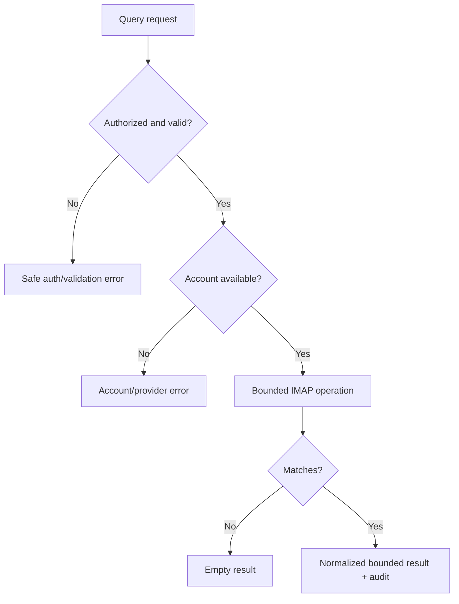

# Flow — Account discovery and bounded query

## Trigger / entry point

Hermes `main` needs account status or mailbox data and invokes `mail_accounts` or `mail_query`.

## Steps

1. Hermes sends a strictly schema-validated request with `accountId` where required.
2. The gateway authenticates the caller and checks `main` authorization.
3. The gateway resolves the account from the local registry and applies folder, query, reference, result, and body-size bounds.
4. The IMAP adapter performs the normalized operation using the account's local credential reference.
5. The gateway redacts provider-specific details, returns normalized results and a continuation cursor when needed, and appends an audit event.

## Branches and failure paths

- No matches: return an empty result successfully.
- Unknown account/folder/reference: return a stable validation or routing error.
- Provider timeout/unavailability: return `PROVIDER_UNAVAILABLE`; do not fall back to another account or protocol.
- Result exceeds limits: return a bounded error or partial result only where the schema explicitly defines a cursor; never silently expand the limit.
- Organization action: require the separate allow-listed mutation operation and audit the provider-confirmed result; destructive actions are rejected.

