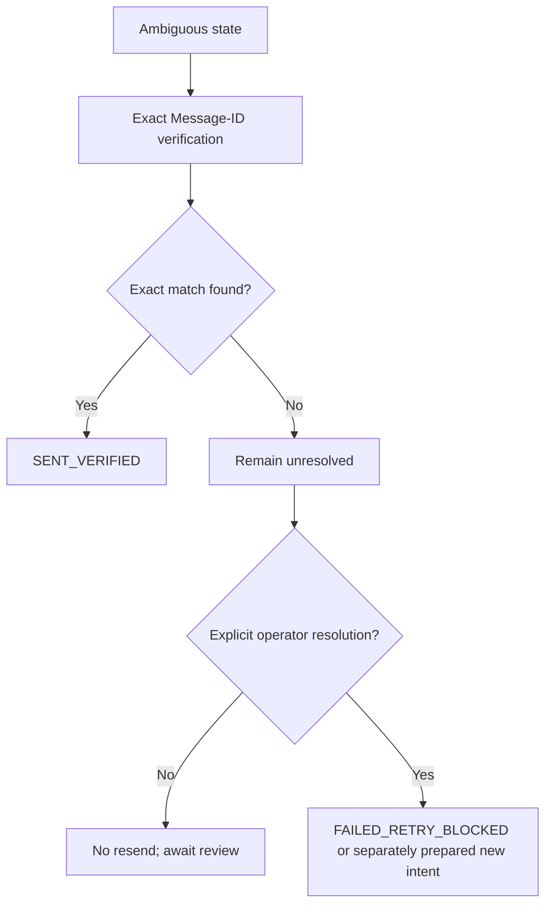

# Flow — Recover an ambiguous send outcome

## Trigger / entry point

An SMTP connection ends after submission may have occurred, or Sent verification cannot establish the exact message.

## Steps

1. Gateway persists `OUTCOME_UNKNOWN` or `SENT_UNVERIFIED` with correlation ID and bounded provider evidence.
2. Gateway returns the state and explicitly instructs the caller/operator to verify the exact preassigned Message-ID.
3. Hermes or the operator invokes `mail_query` with `verifySent` for the same account and gateway message.
4. Gateway searches only the configured Sent location using the exact Message-ID and bounded time/size constraints.
5. Gateway records the observation and transitions to `SENT_VERIFIED` if found.
6. If not found, gateway keeps the state unresolved or records `FAILED_RETRY_BLOCKED` only through an explicit operator resolution procedure.

## Non-negotiable branch

The gateway never automatically calls SMTP again from `OUTCOME_UNKNOWN`, `SENT_UNVERIFIED`, or a provider timeout. A new message requires a new preparation and an explicit human/operator decision after reviewing the original state.

