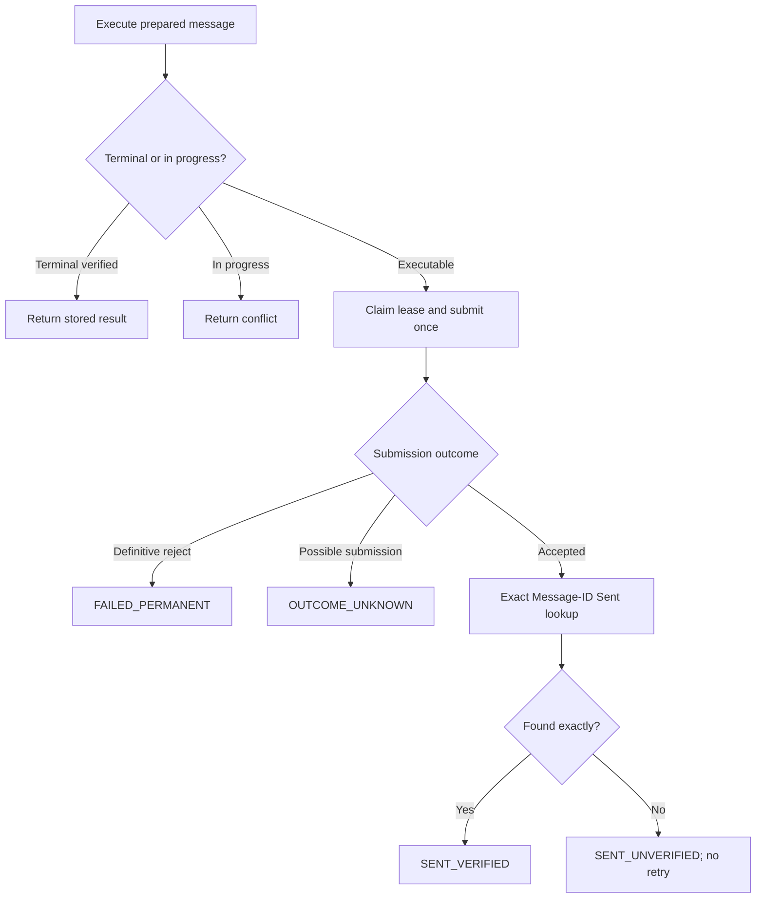

# Flow — Execute and verify a send

## Trigger / entry point

Hermes invokes `mail_execute` for a durable `PREPARED` gateway message.

## Steps

1. Gateway authenticates the caller, checks account ownership, and loads the stored raw MIME BLOB.
2. Gateway loads the immutable outbox row and validates that the state is executable, then atomically acquires an execution lease.
3. SMTP adapter submits exactly the loaded bytes once using the account's configured provider policy.
4. Gateway classifies the provider response and persists the outcome.
6. For an acknowledged submission, the IMAP adapter searches the configured Sent location for the exact Message-ID.
7. Gateway records `SENT_VERIFIED` only when exact verification succeeds; it returns the safe result and audit correlation ID.

## Branches and failure paths

- Already `SENT_VERIFIED`: return the stored terminal result; do not send again.
- Concurrent lease: return `EXECUTION_IN_PROGRESS`; do not send in parallel.
- Definitive SMTP rejection: persist `FAILED_PERMANENT` and return `PROVIDER_REJECTED`.
- Failure before SMTP submission is proven: preserve an executable state only when the adapter proves no submission occurred.
- Connection loss after possible submission: persist `OUTCOME_UNKNOWN`; stop and require the ambiguous-outcome flow.
- Provider accepted but exact Sent verification fails: persist `SENT_UNVERIFIED`; do not append a second copy or retry automatically.

