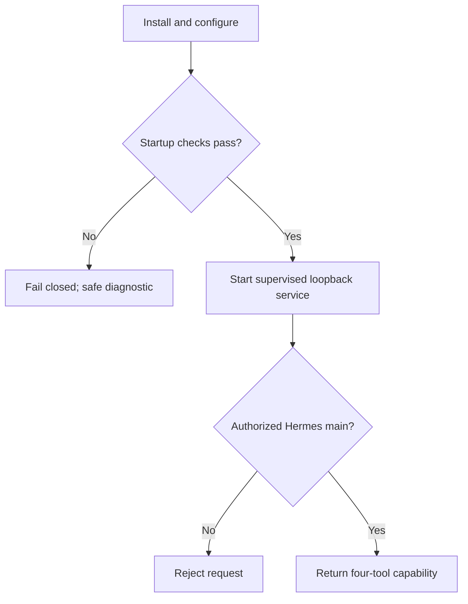

# Flow — Installation and activation

## Trigger / entry point

The operator installs the pinned gateway on Debian 13 and connects Hermes `main` to its loopback MCP endpoint.

## Steps

1. Operator installs the pinned runtime/package and creates the dedicated service-user directories.
2. Operator configures non-secret account metadata and keychain/Secret Service credential references outside the repository.
3. Operator configures the local authorization material and binds the MCP endpoint to loopback.
4. Operator configures the self-test recipient outside the repository and selects the provider Sent policy.
5. The service validates runtime, configuration, migrations, database integrity, and secret-store availability.
6. The service starts under systemd user supervision and exposes exactly four tools to the authorized Hermes `main` client.
7. Hermes calls `mail_accounts`; the gateway returns redacted account metadata and health.

## Branches and failure paths

- Invalid configuration, missing keychain, failed migration, or database failure: startup fails closed; no mail operation is exposed.
- Authorization mismatch: requests receive `AUTH_REQUIRED` or `AUTH_FORBIDDEN`; no account data is returned.
- Provider health failure: service may remain available for other accounts, but the affected account is reported unavailable and cannot send.
- Non-loopback bind or unknown MCP tool registration: activation is rejected during operator verification.

## Recovery

Correct host configuration or credentials, restart the service, and re-run the account health check. Restarting must not execute outbox rows automatically.
