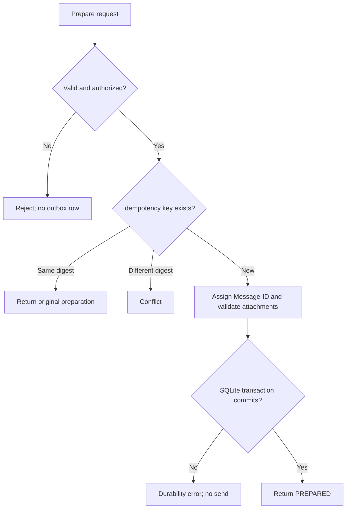

# Flow — Prepare a message

## Trigger / entry point

Hermes has decided to send a new message, reply, or forward and invokes `mail_prepare`.

## Steps

1. Hermes supplies `accountId`, content, recipients, optional reply/forward reference, attachment descriptors, and an idempotency key.
2. The gateway authenticates the caller and validates all fields, including unknown-field rejection and sender policy.
3. The gateway resolves reply headers from the referenced message when applicable.
4. The gateway validates attachment roots, canonical paths, file types, sizes, and hashes.
5. The gateway assigns a unique Message-ID and constructs the immutable MIME intent.
6. In one SQLite transaction, the gateway inserts the outbox row, idempotency mapping, and audit event.
7. The gateway returns the durable gateway message ID and `PREPARED` state. No SMTP or IMAP send occurs.

## Branches and failure paths

- Same idempotency key and same request digest: return the original preparation.
- Same key and different digest: return `IDEMPOTENCY_CONFLICT`; do not overwrite.
- Invalid or changed attachment: reject before persistence.
- SQLite transaction failure: return `DATABASE_UNAVAILABLE`; no preparation is executable.
- Account disabled or sender disallowed: reject before persistence.

